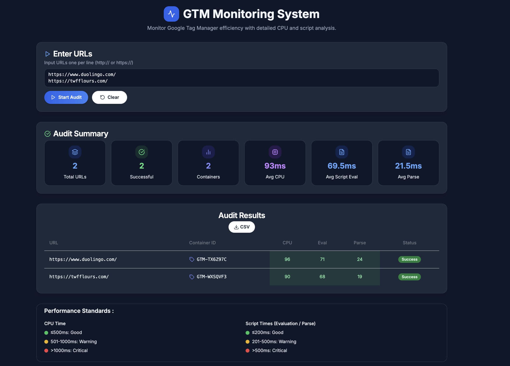

<div align="center">

# 🚀 GTM Monitoring System

### _Next.js Performance Auditor for Google Tag Manager_

[](https://nextjs.org/)
[](https://www.typescriptlang.org/)
[](https://tailwindcss.com/)
[](https://www.docker.com/)
[](https://choosealicense.com/licenses/mit/)

_A professional-grade web application that performs comprehensive Google Tag Manager (GTM) performance audits using real Lighthouse analysis in headless Chrome._



[🚀 **Quick Start**](#-quick-start) • [📚 **Documentation**](#-project-structure) • [🔧 **Configuration**](#-configuration) • [🤝 **Contributing**](#-contributing)

</div>

---

## 📋 Table of Contents

- [✨ **Features**](#-features)
- [🛠️ **Tech Stack**](#-tech-stack)
- [🚀 **Quick Start**](#-quick-start)
- [📁 **Project Structure**](#-project-structure)
- [⚙️ **Configuration**](#-configuration)
- [🤝 **Contributing**](#-contributing)
- [🤖 **For AI Agents & CI**](#-for-ai-agents--ci)
- [🔧 **Troubleshooting**](#-troubleshooting)
- [📈 **Recent Updates**](#-recent-updates)
- [📄 **License**](#-license)

## ✨ Features

<div align="center">

|             🎯 **Core Features**             |   📊 **Analytics & Reporting**   |     🛠️ **Developer Experience**      |
| :------------------------------------------: | :------------------------------: | :----------------------------------: |
| Multiple URL auditing with progress tracking | Color-coded performance metrics  |       Full TypeScript support        |
|      Per-container GTM metrics analysis      |     CSV export functionality     | Accessible UI with Radix + shadcn/ui |
|  Real Lighthouse audits in headless Chrome   | Aggregated performance summaries |     Comprehensive error logging      |
|    ETA calculations for batch processing     |  Performance threshold legends   |       Docker-ready deployment        |

</div>

### 🔥 **Key Capabilities**

- 🌐 **Multi-URL Processing**: Paste multiple URLs and run sequential audits with real-time progress
- 🏷️ **GTM Container Analysis**: Get detailed metrics for each GTM container (e.g., `GTM-XXXX`)
- 🚦 **Smart Color Coding**: Visual indicators for Good/Warning/Critical performance thresholds
- 📈 **Comprehensive Metrics**: CPU usage, Script evaluation time, Script parse time per container
- 🔍 **Server-side Logging**: UUID-tagged requests with detailed timing and performance data
- 📤 **Data Export**: Export results to CSV with per-container breakdowns
- 🎨 **Modern UI**: Built with Next.js 13 App Router, Tailwind CSS, and premium components

## 🛠️ Tech Stack

<div align="center">

### **Frontend Excellence**


### **UI & Components**


### **Performance & Analytics**


### **Development & Deployment**


</div>

| 🎨 **Layer**      | 🔧 **Technology**                   | 📝 **Purpose**                                |
| :---------------- | :---------------------------------- | :-------------------------------------------- |
| **Frontend**      | React 18 + Next.js 13 App Router    | Modern React framework with server components |
| **Styling**       | Tailwind CSS + shadcn/ui + Radix UI | Utility-first CSS with accessible components  |
| **Icons**         | Lucide React                        | Beautiful, customizable SVG icons             |
| **Forms & State** | React Hook Form + Zod               | Type-safe form handling and validation        |
| **API**           | Next.js Route Handlers + Lighthouse | Serverless API with performance auditing      |
| **Performance**   | Chrome Launcher + Puppeteer Core    | Headless browser automation                   |
| **Utilities**     | clsx + tailwind-merge + date-fns    | Class merging and date manipulation           |
| **Logging**       | Structured Console + UUID           | Request tracking and debugging                |
| **Development**   | TypeScript + ESLint + Prettier      | Type safety and code quality                  |

## 🚀 Quick Start

> **Prerequisites**: Node.js ≥ 20 and Google Chrome (stable) installed locally

### 🏃‍♂️ **Local Development**

```bash
# 1️⃣ Clone the repository
git clone <repository-url>
cd GTM-Monitoring-System

# 2️⃣ Install dependencies
npm ci                    # or pnpm install / yarn

# 3️⃣ Start development server
npm run dev              # 🌐 http://localhost:3000
```

### 🐳 **Docker Deployment (Recommended)**

```bash
# 🚀 One-command setup with Docker Compose
docker-compose up --build
# ✅ Application available at http://localhost:3000
```

> 💡 **Note**: Docker provides a consistent environment with all Chrome dependencies pre-configured. See [`DOCKER.md`](./DOCKER.md) for detailed setup and troubleshooting.

### 🏗️ **Production Build**

```bash
# Build for production
npm run build

# Start production server
npm start                # 🌐 http://localhost:3000
```

### 🔧 **Development Commands**

| Command         | Description                 | Usage                    |
| :-------------- | :-------------------------- | :----------------------- |
| `npm run dev`   | 🔥 Start development server | Hot reload enabled       |
| `npm run build` | 🏗️ Create production build  | Optimized for deployment |
| `npm run start` | 🚀 Start production server  | Serve built application  |
| `npm run lint`  | 🔍 Run ESLint checks        | Code quality validation  |

## 📁 Project Structure

<div align="center">

### **🏗️ Architecture Overview**
| Folder / File           | Description                         |
|-------------------------|-------------------------------------|
| app/                    | Next.js App Router                  |
| ├─ api/                 | API routes                          |
| │  └─ audit/route.ts    | Lighthouse audit API                |
| ├─ globals.css          | Tailwind base styles                |
| ├─ layout.tsx           | Root layout & providers             |
| └─ page.tsx             | Main UI component                   |
| components/             | Reusable UI components              |
| └─ ui/                  | shadcn/ui library (47 components)  |
| hooks/                  | Custom React hooks                  |
| └─ use-toast.ts          | Toast notification hook             |
| lib/                    | Utility functions                   |
| └─ utils.ts             | Helper functions (cn, etc.)        |
| docs/                   | Documentation & assets              |
| └─ screenshot.png       | Example screenshot                  |
| docker/                 | Containerization files              |
| └─ Dockerfile           | Production container                |
| config/                 | Project setup                        |
| └─ package.json         | Dependencies & scripts              |

</div>

### 📊 **Component Breakdown**

| 📂 **Directory** | 🎯 **Purpose**                 | 📈 **Count**  |
| :--------------- | :----------------------------- | :-----------: |
| `app/`           | Next.js App Router pages & API |    4 files    |
| `components/ui/` | shadcn/ui component library    | 47 components |
| `hooks/`         | Custom React hooks             |    1 hook     |
| `lib/`           | Utility functions              |   1 utility   |
| `docs/`          | Documentation & screenshots    |    2 files    |

### 🔧 **Key Files**

- **🚀 `app/page.tsx`**: Main GTM Performance Auditor UI component
- **⚡ `app/api/audit/route.ts`**: Lighthouse audit API with Chrome launcher
- **🎨 `app/layout.tsx`**: Root layout with theme providers and global styles
- **🛠️ `lib/utils.ts`**: Utility functions including the popular `cn()` helper
- **🍞 `hooks/use-toast.ts`**: Toast notification system for user feedback

## ⚙️ Configuration

<div align="center">

### **🎛️ Configuration Hub**

</div>

| ⚙️ **Setting**                | 📁 **File Location**                      | 📝 **Description**                                |
| :---------------------------- | :---------------------------------------- | :------------------------------------------------ |
| 🚦 **Performance Thresholds** | `app/page.tsx` → `getPerformanceStatus()` | Customize warning/critical performance cut-offs   |
| 🔍 **Lighthouse Flags**       | `app/api/audit/route.ts`                  | Chrome launch parameters for Docker/Cloud Run     |
| 🎨 **Theme Colors**           | `tailwind.config.ts`                      | CSS variables for easy theme customization        |
| 🌍 **Environment Variables**  | `.env.local` (optional)                   | Runtime configuration (Chrome path set in Docker) |

### 🚀 **Lighthouse Configuration**

```typescript
// Optimized Chrome flags for containerized environments
const CHROME_FLAGS = [
  "--headless",
  "--disable-gpu",
  "--no-sandbox",
  "--disable-setuid-sandbox",
  "--disable-dev-shm-usage",
  "--remote-debugging-address=0.0.0.0",
];
```

### 🎨 **Theme Customization**

```typescript
// tailwind.config.ts - Easy theme switching
module.exports = {
  theme: {
    extend: {
      colors: {
        border: "hsl(var(--border))",
        background: "hsl(var(--background))",
        foreground: "hsl(var(--foreground))",
        // ... CSS variables for complete theme control
      },
    },
  },
};
```

### 🔧 **Performance Thresholds**

| 📊 **Metric**     | 🟢 **Good** | 🟡 **Warning** | 🔴 **Critical** |
| :---------------- | :---------: | :------------: | :-------------: |
| CPU Usage         |   < 50ms    |    50-100ms    |     > 100ms     |
| Script Evaluation |   < 100ms   |   100-300ms    |     > 300ms     |
| Script Parse Time |   < 50ms    |    50-150ms    |     > 150ms     |

## 🤝 Contributing

<div align="center">

### **🌟 Join Our Community**

_We welcome contributions from developers of all skill levels!_

[](CONTRIBUTING.md)
[](https://github.com/your-repo/issues?q=is%3Aopen+is%3Aissue+label%3A%22good+first+issue%22)

</div>

### 🎯 **Contribution Workflow**

#### 1️⃣ **Branch Naming Convention**

```bash
feat/feature-name       # ✨ New features
fix/bug-name           # 🐛 Bug fixes
chore/task-name        # 🔧 Maintenance tasks
docs/documentation     # 📚 Documentation updates
```

#### 2️⃣ **Development Standards**

| 🎯 **Aspect**  | 📋 **Requirements**                          |
| :------------- | :------------------------------------------- |
| **Code Style** | Run `npm run lint` - zero warnings allowed   |
| **Components** | Keep small, typed, and reusable              |
| **Styling**    | Use Tailwind utility classes + `cn()` helper |
| **TypeScript** | Full type coverage, strict mode enabled      |

#### 3️⃣ **Commit Message Format (Conventional Commits)**

```bash
feat: add CSV export functionality
fix(api): resolve invalid URL error handling
docs: update installation instructions
chore: upgrade lighthouse to v12.8.1
```

#### 4️⃣ **Pull Request Checklist**

- [ ] ✅ ESLint passes (`npm run lint`)
- [ ] 🏗️ Production build succeeds (`npm run build`)
- [ ] 🧪 Tests added/updated (when applicable)
- [ ] 📚 Documentation updated (for behavior changes)
- [ ] 🎨 UI changes tested across devices
- [ ] 🔍 Code reviewed for security best practices

### 🌟 **Good First Issues**

Perfect for new contributors:

- [ ] 🌙 **Add dark mode toggle** in `layout.tsx`
- [ ] 🧪 **Write unit tests** for `calculateSummary()` function
- [ ] 📊 **Add new performance metrics** to the dashboard
- [ ] 🎨 **Improve mobile responsiveness** of results table
- [ ] 📝 **Create component documentation** with Storybook

### 🛠️ **Development Setup**

```bash
# 1. Fork and clone the repository
git clone https://github.com/your-username/GTM-Monitoring-System.git

# 2. Create a new branch
git checkout -b feat/your-feature-name

# 3. Make your changes and test
npm run dev
npm run lint
npm run build

# 4. Commit and push
git add .
git commit -m "feat: add amazing new feature"
git push origin feat/your-feature-name

# 5. Create a Pull Request 🚀
```

## 🔧 Troubleshooting

<div align="center">

### **🚨 Common Issues & Solutions**

_Quick fixes for the most frequent problems_

</div>

| 🔍 **Issue**                | 💡 **Solution**                                  | 📁 **Reference**                             |
| :-------------------------- | :----------------------------------------------- | :------------------------------------------- |
| 🚫 Chrome launch fails      | Check Chrome installation and sandbox flags      | [`error-log.md`](./error-log.md)             |
| 🐳 Docker connection errors | Verify Chrome flags in containerized environment | [`DOCKER.md`](./DOCKER.md)                   |
| 📦 Build failures           | Clear `.next` folder and reinstall dependencies  | `npm run clean && npm ci`                    |
| 🔧 TypeScript errors        | Check `tsconfig.json` and update types           | `npm run type-check`                         |
| 🎨 Styling issues           | Verify Tailwind configuration and imports        | [`tailwind.config.ts`](./tailwind.config.ts) |

### 🆘 **Quick Fixes**

```bash
# 🧹 Clean installation
rm -rf node_modules .next package-lock.json
npm install

# 🔍 Debug Chrome issues
google-chrome --version
which google-chrome

# 🐳 Docker troubleshooting
docker-compose down
docker-compose up --build --force-recreate
```

### 📞 **Support Resources**

- 📚 **Documentation**: Comprehensive guides in `/docs` folder
- 🐛 **Issue Tracker**: Report bugs with detailed reproduction steps
- 💬 **Discussions**: Community Q&A and feature requests
- 📧 **Contact**: Technical support for deployment issues

## 🤖 For AI Agents & CI

<div align="center">

### **🚀 Automated Development Workflow**

_Perfect for AI-driven development and continuous integration_

</div>

### 🔧 **Quality Assurance Commands**

```bash
# 🔍 Code quality checks
npm run lint              # ESLint + TypeScript validation
npm test                  # Jest test suite (when implemented)
npm run build            # Production build verification
npm run type-check       # TypeScript compilation check
```

### 🤖 **AI Agent Guidelines**

| 🎯 **Rule**     | 📝 **Description**                                                |
| :-------------- | :---------------------------------------------------------------- |
| **File Safety** | Never commit generated `.next/`, `node_modules/`, or `.env` files |
| **Code Format** | Always run `prettier --write .` before committing                 |
| **Focused PRs** | Keep changes minimal and focused on single features               |
| **Type Safety** | Maintain strict TypeScript compliance                             |
| **Testing**     | Add tests for new functionality                                   |

### 🔄 **CI/CD Integration**

```yaml
# Example GitHub Actions workflow
name: Quality Check
on: [push, pull_request]
jobs:
  test:
    runs-on: ubuntu-latest
    steps:
      - uses: actions/checkout@v3
      - uses: actions/setup-node@v3
        with:
          node-version: "20"
      - run: npm ci
      - run: npm run lint
      - run: npm run build
      - run: npm test
```

### 🎯 **AI-Friendly Development**

- **📁 Clear file structure** with descriptive naming
- **📝 Comprehensive TypeScript** for better code understanding
- **🧩 Modular components** for easy modification
- **📚 Extensive documentation** in code comments
- **🔧 Consistent patterns** across the codebase

## 📈 Recent Updates

<div align="center">

### **🚀 What's New in GTM Monitoring System**

_Latest improvements and feature additions_

</div>

### 🔥 **Version 2.1.0** - _September 2025_

#### 🐳 **Docker & Infrastructure**

- **✅ Chrome Launch Fixes**: Updated `CHROME_FLAGS` with `--disable-gpu`, `--disable-setuid-sandbox`, and `--remote-debugging-address=0.0.0.0`
- **🏥 Health Checks**: Added DevTools endpoint validation for faster failure detection
- **📊 Enhanced Logging**: Chrome port logging and WebSocket URL validation
- **🔧 Type Safety**: Removed unsupported `host` option from chrome-launcher

#### 📖 **Documentation & DX**

- **🚀 Quick Start Guide**: Streamlined setup instructions with Docker focus
- **⚙️ Configuration Docs**: Expanded Chrome flags and environment setup notes
- **🎯 Contributing Guidelines**: Clear PR checklist and development standards

---

### 🎯 **Version 2.0.0** - _August 2025_

#### 🔄 **Architecture Overhaul**

- **🏷️ Per-Container Metrics**: Individual GTM container analysis instead of aggregated data
- **📋 Structured Logging**: UUID-tagged requests with detailed timing metrics
- **⚡ Performance Optimization**: Removed blocking time metrics for better accuracy
- **🧹 Code Cleanup**: Eliminated duplicate functions and legacy implementations

#### 🎨 **Frontend Improvements**

- **📊 New Results Table**: One row per GTM container with CPU, Script Eval, and Parse metrics
- **📤 Enhanced Exports**: CSV includes container IDs and per-container averages
- **🎛️ UI Rewrite**: Modern component architecture with improved accessibility

#### 🔧 **Technical Debt**

- **📁 Type Safety**: Improved Map iteration and stricter TypeScript compliance
- **🚀 Chrome Flags**: Consolidated serverless-safe launch arguments
- **📚 Documentation**: Updated README to reflect per-container metrics approach

---

### 🔮 **Upcoming Features**

- [ ] 🌙 **Dark Mode Toggle**: Theme switching capability
- [ ] 🧪 **Unit Test Suite**: Comprehensive Jest testing framework
- [ ] 📱 **Mobile Optimization**: Enhanced responsive design
- [ ] 📊 **Advanced Analytics**: Historical performance tracking
- [ ] 🔌 **API Webhooks**: External system integrations

## 📄 License

<div align="center">

### **📜 MIT License**

_Open source and freely available for everyone_

[](https://choosealicense.com/licenses/mit/)

**Copyright © 2025 Mradul Mishra**

Permission is hereby granted, free of charge, to any person obtaining a copy of this software and associated documentation files (the "Software"), to deal in the Software without restriction, including without limitation the rights to use, copy, modify, merge, publish, distribute, sublicense, and/or sell copies of the Software.

---

### **🤝 Contributing & Support**

<div align="center">

**Built with ❤️ by the community**

[⭐ **Star this repo**](../../stargazers) • [🐛 **Report issues**](../../issues) • [💡 **Request features**](../../issues/new) • [🤝 **Contribute**](#-contributing)

**Made with** [](https://nextjs.org/) [](https://www.typescriptlang.org/) [](https://tailwindcss.com/)

</div>

</div>
